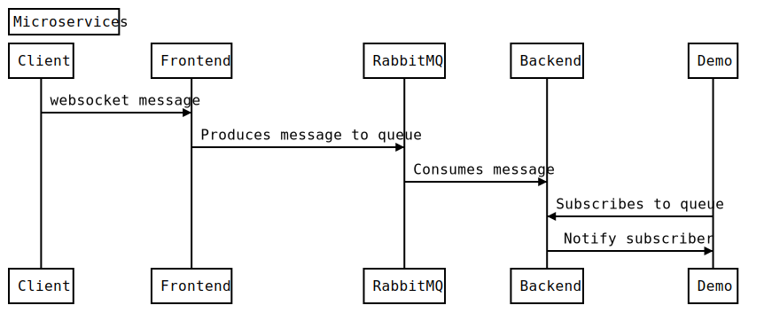

# micro-ws
Microservices in Go using websockets and a message queue.

There are 4 services

```
root
└───client
|
└───frontend
|
└───backend
|
└───demo
```
## Overview
### Client
Client will generate ws messages each second forever and send them to the frontend.

### Frontend
This is the service that will receive the ws messages and act as a produces in RabbitMQ. 
This service has a epoll implementation to listen for more file descriptors, inspired by [eranyanay](https://github.com/eranyanay/1m-go-websockets). As a result it has an increased throuput and a smaller memory footprint mostly due to the performant design in gobwas/ws library that allows to reuse the allocated buffers between connections.

### Backend
Backend will consume from the RabbitMQ queue and notify all the registered subscribers to the correspondent queue.
It has a gRPC endpoint to register subscribers to queues.
This service has tests and a rudimentary in-memory database to showcase the observer pattern.

### Demo
This service serves as a demonstration of a subscriber. It will call the `Backend` to subscribe to a queue through gRPC and it will receive messages through ws.

## Run
`docker-compose up`

## Flow

